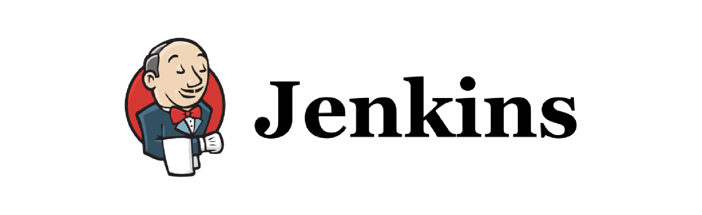
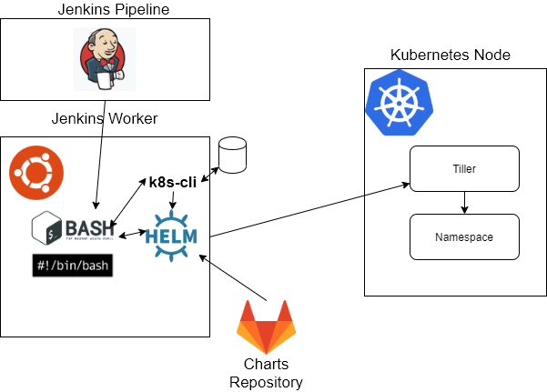
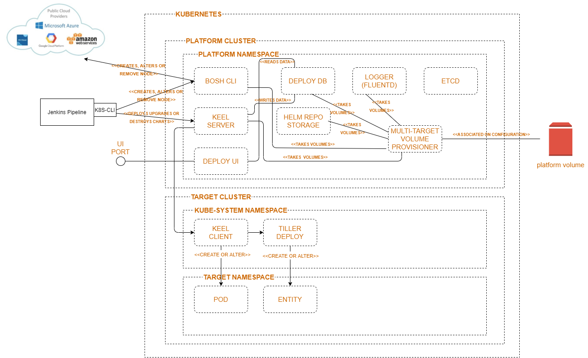

</img>

 

# kubernetes-jenkins-procedures

Project that contains Jenkins deploy procedures and data 

It cointains [dsl_jobs](/dsl_jobs) containing artifacts used to create (install) the Jenkins jobs.

It's necessary on the jenkins machine/repository of full clean installation of following products:
* [curl](https://curl.haxx.se/) -> net call tool
* [jq](https://stedolan.github.io/jq/) -> json parser tool
* [yq](https://mikefarah.gitbook.io/yq/) -> yaml parser tool
* [helm](https://helm.sh/) -> Kubernetes Charts Tool
* [k8s-cli](https://github.com/hellgate75/k8s-cli) -> Kubernetes cluster local repository manager.

You must execute setup scripts:
* [install-golang.sh](/install-golang.sh)
* [install-k8s-cli.sh ](/install-k8s-cli.sh)
* [init-charts.sh](/init-charts.sh)

In order to understand the procedure pleae start reading the DSL Jenkins files, present in folder  [dsl_jobs](/dsl_jobs).

## Architecture

The full scripting sampler is based on the following architectral design:

 

</img>

 

A more suotable and productin ready Ci-Cd architecture sounds like the following one:

 

</img>

 

Enjoy your experience

## License

All rights are reserved by the author: [Fabrizio Torelli](mailto:hellgate75@gmail.com) undel [LGPL v3 License](/LICENSE) minimum requirements, and idividual creative rights. Any use with production, commercial, e-leanring or distribution purposes of this repository content must be authorized by the author, and any abouse will be persecuted accordingly to international laws. You can follow authors articles on [LinkedIn](https://www.linkedin.com/in/fabriziotorelli) for further information or updates.
